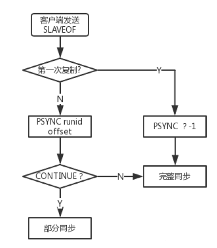

# 一、主从复制，也叫主从同步

​		主从同步分为全量同步和增量同步；

​		从机刚刚连接上主机的时候，进行全量同步；

​		断线重连有可能触发全量同步也有可能是增量同步（ master 判断runid 是否一致）。

​		其他情况都是增量同步；

## 		1、全量同步分为三个阶段：

### 			1)、同步快照阶段：

​					Salve会发送sync命令到Master，Master 创建并发送快照给Slave ， Slave 载入并解析快照。Master 					同时将此阶段所产生的新的写命令存储到缓冲区；

### 			2)、同步写缓冲阶段：

​					Master向Slave同步存储在缓冲区的写操作命令；

### 			3)、同步增量阶段：

​					Master向Slave同步写操作命令。

## 		2、增量同步：

​				Slave完成初始化后开始正常工作时，Master发生的写操作同步到Slave的过程。

​				

Redis在2.8版本之后，提供PSYNC命令来带代替SYNC命令，为Redis主从复制提供了部分复制的能力；

​        1、客户端向服务器发送SLAVEOF命令，让当前服务器成为Slave； 
  2、当前服务器根据自己是否保存Master runid来判断是否是第一次复制，如果是第一次同步则跳转到3，否			  则跳转到4； 
  3、向Master发送PSYNC ? -1 命令来进行完整同步； 
  4、向Master发送PSYNC runid offset； 
  5、Master接收到PSYNC 命令后首先判断runid是否和本机的id一致，如果一致则会再次判断offset偏移量和			  本机的偏移量相差有没有超过复制积压缓冲区大小，如果没有那么就给Slave发送CONTINUE，此时Slave      			  只需要等待Master传回失去连接期间丢失的命令； 
  6、如果runid和本机id不一致或者双方offset差距超过了复制积压缓冲区大小，那么就会返回FULLRESYNC   			  runid offset，Slave将runid保存起来，并进行完整同步。

# 二、哨兵机制

​        哨兵机制(Sentinel机制)完成Master的动态选举。

## 		1、作用：

​				监控：哨兵( sentinel ) 会不断地检查你的Master 和Slave 是否运作正常。

​				提醒：当被监控的某个Redis 节点出现问题时, 哨兵( sentinel ) 可以通过API 向管理员或者其他应用程序                            							发送通知。
​				自动故障迁移：当一个Master不能正常工作时，哨兵会开始一次自动故障迁移操作；

## 		2、故障判定原理：

​				1、每个sentinel 进程以固定的频率(每秒1次)向主、从服务器发送PING命令；

​				2、如果某个服务器回复PING命令时间超过down-after-milliseconds选项所指定的值，则被sentinel标记					  为主观下线(SDOWN)；

​				3、如果一个Master被标记为主观下线(SDOWN)之后，则正在监视这个Master的所有sentinel 进程都要

​					  以每秒一次的频率确认Master的确进入了主观下线状态。

​				4、当有足够数量的sentinel进程在指定的时间范围内确认Master 主服务器进入了主观下线状态， 则					  Master 主服务器会被标记为客观下线（ODOWN）。

​				5、正常情况下，sentinel进程以每10秒一次的频率向所有的主、从服务器发送INFO命令，当Master被					  标记为客观下线之后，频率变为妹秒一次；

​				6、若没有足够的数量的sentinel标记Master下线，则Master的客观下线状态将被移除；若Master重新					  向sentinel发送的PING命令返回有效回复，则Master的主观下线状态将被移除。

## 	3、自动故障转移

​				1、将失效Master的其中一个Slave升级为新的Master，并让失效Master的其他Slave复制新的Master;

​				2、客户端试图连接失效的Master 时，集群也会向客户端返回新Master 的地址，使得集群可以使用现在					  的Master 替换失效Master；

​				3、Master 和Slave 服务器切换后， Master 的redis.conf 、Slave 的redis.conf 和sentinel.conf 的配置					  文件的内容都会发生相应的改变，即 Master 主服务器的redis.conf配置文件中会多一行slaveof 的					  配置， sentinel.conf 的监控目标会随之调换。

# 三、Redis常见问题整理

## 读数据常见问题：	

### 	1、缓存穿透

​				对不存在的key进行高并发访问，导致数据库压力瞬间增大，就叫缓存穿透。

​				解决方案：
​						对查询结果为空的情况也进行缓存，缓存时间设置短一点，或者该key对应的数据insert了之后清理						缓存。

### 	2、缓存雪崩

​				当缓存服务器重启或者大量缓存集中在某一个时间段失效，若此时存在大量数据访问压力落在数据库				上，称为缓存雪崩现象；

​				解决方案:
​						1、 key的失效期分散开 不同的key设置不同的有效期
​						2、设置二级缓存
​						3、高可用

### 	3、缓存击穿

​				在某个时间点，单个缓存失效，此时有大量的请求进来，导致访问到数据库，高并发的请求可能会瞬间				把后端DB压垮；该现象称为缓存击穿。

​				解决方案：

​						用分布式锁控制访问的线程

​						if(redis.sexnx()==1)

​						{
​								//先查询缓存
​								//查询数据库
​								//加入缓存
​						}

## 写数据常见问题：	

### 1、如何保证数据的最终一致性？

​		1)、先更新数据库同时删除缓存项(key)，等读的时候再填充缓存
​		2)、2秒后再删除一次缓存项(key)
​		3)、设置缓存过期时间 Expired Time 比如 10秒 或1小时
​		4)、将缓存删除失败记录到日志中，利用脚本提取失败记录再次删除（缓存失效期过长 7*24）

升级方案
		通过数据库的binlog来异步淘汰key，利用工具(canal)将binlog日志采集发送到MQ中，然后通过ACK(Acknowledge)机制(消息确认机制)确认处理删除缓存；