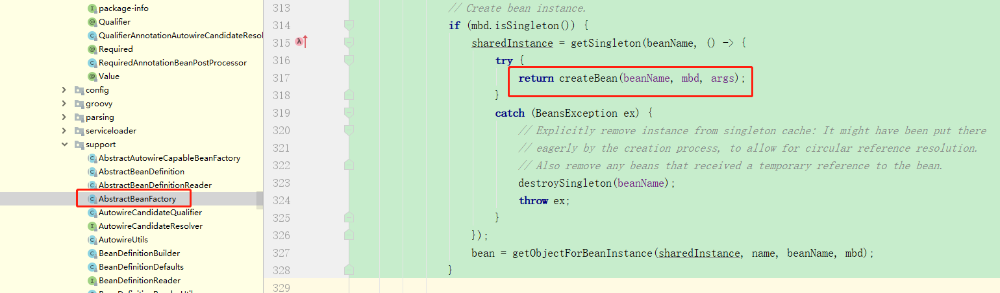
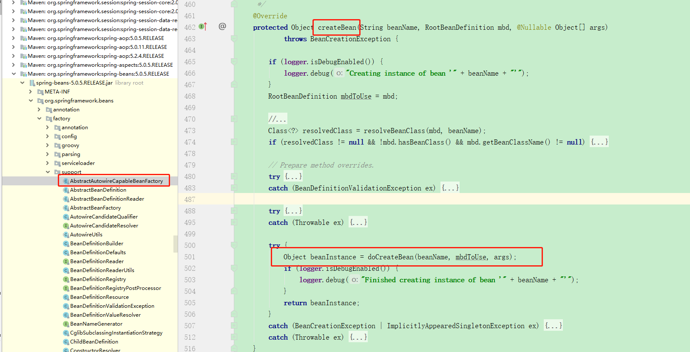
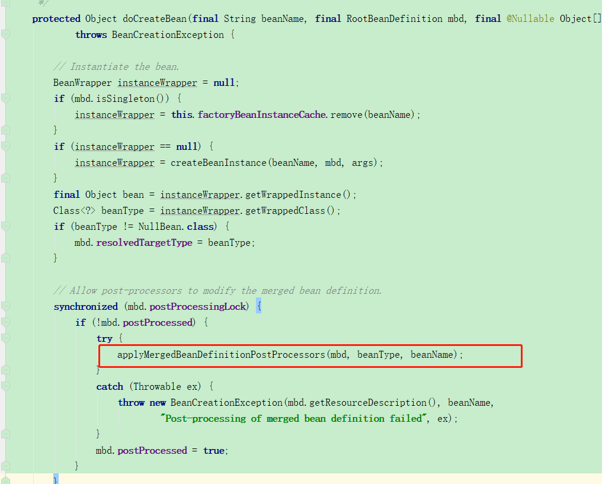
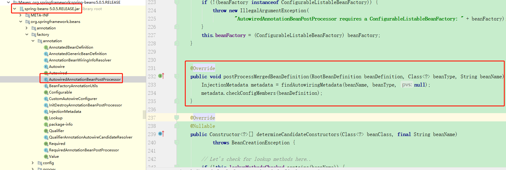
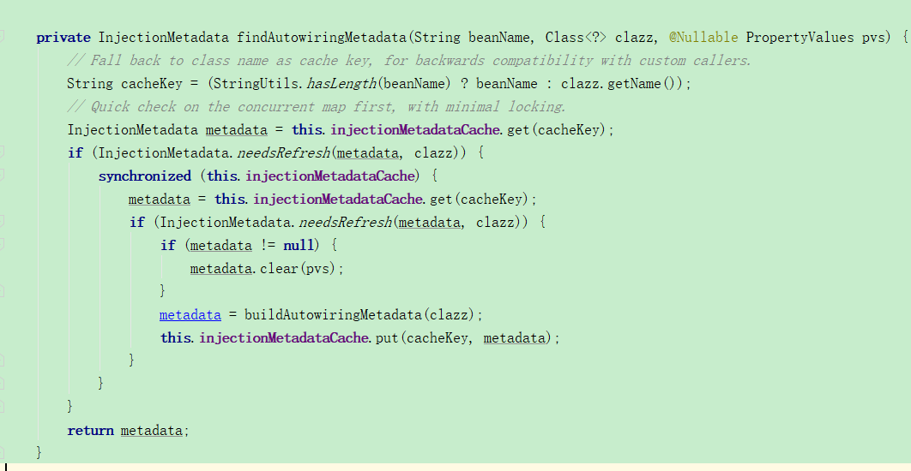

## spring中 @Autowire注解实现原理：

```java
@Target({ElementType.CONSTRUCTOR, ElementType.METHOD, ElementType.PARAMETER, ElementType.FIELD, ElementType.ANNOTATION_TYPE})
@Retention(RetentionPolicy.RUNTIME)
@Documented
public @interface Autowired {

   /**
    * Declares whether the annotated dependency is required.
    * <p>Defaults to {@code true}.
    */
   boolean required() default true;

}
```

不难看出，Autowired注解可以应用在构造方法、普通方法、参数、字段，以及注解这五种类型中。

### @Autowire流程解析：

加载流程：

| Class                              | Method                                  | Description                                |
| ---------------------------------- | --------------------------------------- | ------------------------------------------ |
| AbstractBeanFactory                | doGetBean                               | 先从缓存中寻找是否存在对应bean，没有则创建 |
| DefaultSingletonBeanRegistry       | getSingleton                            | 查询是否有对应的单例bean，没有则创建       |
| AbstractAutowireCapableBeanFactory | createBean                              | 调用创建bean                               |
| AbstractAutowireCapableBeanFactory | doCreateBean                            | 实例化、填充属性                           |
| AbstractAutowireCapableBeanFactory | createBeanInstance                      | 调用创建bean                               |
| AbstractAutowireCapableBeanFactory | applyMergedBeanDefinitionPostProcessors | 合并bean的处理信息                         |

1、AbstractBeanFactory中的doGetBean方法：








```java
protected void applyMergedBeanDefinitionPostProcessors(RootBeanDefinition mbd, Class<?> beanType, String beanName) {
   for (BeanPostProcessor bp : getBeanPostProcessors()) {
      if (bp instanceof MergedBeanDefinitionPostProcessor) {
         MergedBeanDefinitionPostProcessor bdp = (MergedBeanDefinitionPostProcessor) bp;
         bdp.postProcessMergedBeanDefinition(mbd, beanType, beanName);
      }
   }
}
```

2、@Autowire作用的对象数据初始化，获取InjectionMetadata对象





```java
private InjectionMetadata buildAutowiringMetadata(final Class<?> clazz) {
   LinkedList<InjectionMetadata.InjectedElement> elements = new LinkedList<>();
   Class<?> targetClass = clazz;

   do {
      final LinkedList<InjectionMetadata.InjectedElement> currElements = new LinkedList<>();

      ReflectionUtils.doWithLocalFields(targetClass, field -> {
          //查找class中的字段，是否使用Autowire注解，并返回其Autowire注解的相关属性
         AnnotationAttributes ann = findAutowiredAnnotation(field);
         if (ann != null) {
            if (Modifier.isStatic(field.getModifiers())) {
               if (logger.isWarnEnabled()) {
                  logger.warn("Autowired annotation is not supported on static fields: " + field);
               }
               return;
            }
            boolean required = determineRequiredStatus(ann);
            //elements存放Autowire注解字段
            currElements.add(new AutowiredFieldElement(field, required));
         }
      });

      ReflectionUtils.doWithLocalMethods(targetClass, method -> {
         Method bridgedMethod = BridgeMethodResolver.findBridgedMethod(method);
         if (!BridgeMethodResolver.isVisibilityBridgeMethodPair(method, bridgedMethod)) {
            return;
         }
         //查找class中的方法，是否使用Autowire注解，并返回其Autowire注解的相关属性
         AnnotationAttributes ann = findAutowiredAnnotation(bridgedMethod);
         if (ann != null && method.equals(ClassUtils.getMostSpecificMethod(method, clazz))) {
            if (Modifier.isStatic(method.getModifiers())) {
               if (logger.isWarnEnabled()) {
                  logger.warn("Autowired annotation is not supported on static methods: " + method);
               }
               return;
            }
            if (method.getParameterCount() == 0) {
               if (logger.isWarnEnabled()) {
                  logger.warn("Autowired annotation should only be used on methods with parameters: " +
                        method);
               }
            }
            boolean required = determineRequiredStatus(ann);
            PropertyDescriptor pd = BeanUtils.findPropertyForMethod(bridgedMethod, clazz); 
             //elements存放Autowire注解方法
            currElements.add(new AutowiredMethodElement(method, required, pd));
         }
      });

      elements.addAll(0, currElements);
      targetClass = targetClass.getSuperclass();
   }
   while (targetClass != null && targetClass != Object.class);
   //返回数据集
   return new InjectionMetadata(clazz, elements);
}
```

```java
public InjectionMetadata(Class<?> targetClass, Collection<InjectedElement> elements) {
   this.targetClass = targetClass;
   this.injectedElements = elements;
}
```

3、@Autowire的依赖注入

```java
@Override
public PropertyValues postProcessPropertyValues(
      PropertyValues pvs, PropertyDescriptor[] pds, Object bean, String beanName) throws BeanCreationException {
   //InjectionMetadata对象
   InjectionMetadata metadata = findAutowiringMetadata(beanName, bean.getClass(), pvs);
   try {
      //调用InjectionMetadata中的inject函数
      metadata.inject(bean, beanName, pvs);
   }
   catch (BeanCreationException ex) {
      throw ex;
   }
   catch (Throwable ex) {
      throw new BeanCreationException(beanName, "Injection of autowired dependencies failed", ex);
   }
   return pvs;
}
```

```java
public void inject(Object target, @Nullable String beanName, @Nullable PropertyValues pvs) throws Throwable {
   Collection<InjectedElement> checkedElements = this.checkedElements;
   Collection<InjectedElement> elementsToIterate =
         (checkedElements != null ? checkedElements : this.injectedElements);
   if (!elementsToIterate.isEmpty()) {
      boolean debug = logger.isDebugEnabled();
      for (InjectedElement element : elementsToIterate) {
         if (debug) {
            logger.debug("Processing injected element of bean '" + beanName + "': " + element);
         }
         //InjectedElement是一个抽象类，其中inject函数被子类重写，此处实现区分是Field还是Method
         //子类为AutowiredFieldElement、AutowiredMethodElement
         element.inject(target, beanName, pvs);
      }
   }
}
```

4、InjectedElement子类中，inject给对象赋值

```java
@Override
protected void inject(Object bean, @Nullable String beanName, @Nullable PropertyValues pvs) throws Throwable {
   Field field = (Field) this.member;
   Object value;
   if (this.cached) {
      value = resolvedCachedArgument(beanName, this.cachedFieldValue);
   }
   else {
      DependencyDescriptor desc = new DependencyDescriptor(field, this.required);
      desc.setContainingClass(bean.getClass());
      Set<String> autowiredBeanNames = new LinkedHashSet<>(1);
      Assert.state(beanFactory != null, "No BeanFactory available");
      TypeConverter typeConverter = beanFactory.getTypeConverter();
      try {
         value = beanFactory.resolveDependency(desc, beanName, autowiredBeanNames, typeConverter);
      }
      catch (BeansException ex) {
         throw new UnsatisfiedDependencyException(null, beanName, new InjectionPoint(field), ex);
      }
      synchronized (this) {
         if (!this.cached) {
            if (value != null || this.required) {
               this.cachedFieldValue = desc;
               registerDependentBeans(beanName, autowiredBeanNames);
               if (autowiredBeanNames.size() == 1) {
                  String autowiredBeanName = autowiredBeanNames.iterator().next();
                  if (beanFactory.containsBean(autowiredBeanName) &&
                        beanFactory.isTypeMatch(autowiredBeanName, field.getType())) {
                     this.cachedFieldValue = new ShortcutDependencyDescriptor(
                           desc, autowiredBeanName, field.getType());
                  }
               }
            }
            else {
               this.cachedFieldValue = null;
            }
            this.cached = true;
         }
      }
   }
    //给Bean对象赋值
   if (value != null) {
      ReflectionUtils.makeAccessible(field);
      field.set(bean, value);
   }
}
```