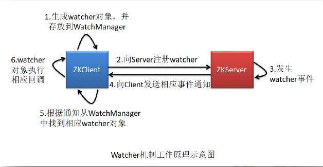

## ZK知识点二

#### 一、ZK的Watcher机制

​		Watcher机制包括三部分：注册、存储、通知



​		1、客户端首先将Watcher注册到服务端，同时将Watcher对象保存到客户端的WatchManager中。

​		2、当ZooKeeper服务端监听的数据状态发生变化时，服务端会主动通知客户端，

​		3、客户端收到事件通知，WatchManager会触发相关Watcher来回调相应处理逻辑。

​		

备注：

​		1、Watcher是一次性的，一旦被触发就会移除，再次使用时需要重新注册。

​		2、Watcher回调是顺序串行化执行的。

#### 二、ZK通知状态、事件类型

### KeeperState通知状态

| Type                 | 说明                                                         |
| -------------------- | ------------------------------------------------------------ |
| Disconnected(0)      | 客户端与服务器断开连接                                       |
| SyncConnected(3)     | 客户端与服务器正常连接                                       |
| AuthFailed(4)        | 身份认证失败                                                 |
| ConnectedReadOnly(5) | 若客户端设置了允许只读模式，则当zk集群中只有少于半数的服务器正常时，会返回这个状态给客户端，此时客户端只能处理读请求。 |
| SaslAuthenticated(6) | 服务器采用SASL做校验                                         |
| Expired(-112)        | 会话session失效                                              |
| Closed(7)            | 客户端关闭                                                   |

### EventType事件类型

| Type                       | 说明                                      |
| -------------------------- | ----------------------------------------- |
| None(-1)                   | 无                                        |
| NodeCreated(1)             | Watcher监听的数据节点被创建               |
| NodeDeleted(2)             | Watcher监听的数据节点被删除               |
| NodeDataChanged(3)         | Watcher监听的数据节点内容发生改变         |
| NodeChildrenChanged(4)     | Watcher监听的数据节点的子节点列表发生改变 |
| DataWatchRemoved(5)        | Watcher监听移除                           |
| ChildWatchRemoved(6)       | 子Watcher监听移除                         |
| PersistentWatchRemoved (7) | 永久Watcher对象的移除                     |


### 三、Watch注册

ClientCnxn：是 zk 客户端和 zk服务器端进行通信和事件通知处理的主要类，它内部包含两个类，

​			SendThread ：负责客户端和服务器端的数据通信, 也包括事件信息的传输

​			EventThread : 主要在客户端回调注册的 Watchers 进行通知处理

#### 1、创建连接

```java
final ZooKeeper zooKeeper = new ZooKeeper("10.32.31.113:2181", 4000, new Watcher() {
    @Override
    public void process(WatchedEvent event) {
        if (Event.KeeperState.SyncConnected == event.getState()) {
            //如果收到了服务端的响应事件，连接成功
            System.out.println("SyncConnected");
        }
    }
});
```

```java
public ZooKeeper(String connectString, int sessionTimeout, Watcher watcher, boolean canBeReadOnly) throws IOException {
    this.watchManager = new ZooKeeper.ZKWatchManager();
    LOG.info("Initiating client connection, connectString=" + connectString + " sessionTimeout=" + sessionTimeout + " watcher=" + watcher);
    this.watchManager.defaultWatcher = watcher;
    ConnectStringParser connectStringParser = new ConnectStringParser(connectString);
    HostProvider hostProvider = new StaticHostProvider(connectStringParser.getServerAddresses());
    //负责客户端与服务器之间的通信
    this.cnxn = new ClientCnxn(connectStringParser.getChrootPath(), hostProvider, sessionTimeout, this, this.watchManager, getClientCnxnSocket(), canBeReadOnly);
    this.cnxn.start();
}

 public void start() {
        this.sendThread.start();
        this.eventThread.start();
    }
```

SendThread.java

```java
  class SendThread extends Thread {
        public void run(){
            if (!clientCnxnSocket.isConnected()) {
            	//建立连接
            	this.startConnect();
            	this.clientCnxnSocket.updateLastSendAndHeard();
            }
            //省略一堆代码********
            
            //队列发送
            this.clientCnxnSocket.doTransport(to, ClientCnxn.this.pendingQueue, ClientCnxn.this.outgoingQueue, ClientCnxn.this);
        }
    }

  private void startConnect() throws IOException {
            ClientCnxn.this.state = States.CONNECTING;
            InetSocketAddress addr;
            if (this.rwServerAddress != null) {
                addr = this.rwServerAddress;
                this.rwServerAddress = null;
            } else {
                addr = ClientCnxn.this.hostProvider.next(1000L);
            }

            this.setName(this.getName().replaceAll("\\(.*\\)", "(" + addr.getHostName() + ":" + addr.getPort() + ")"));
            if (ZooKeeperSaslClient.isEnabled()) {
                try {
                    String principalUserName = System.getProperty("zookeeper.sasl.client.username", "zookeeper");
                    ClientCnxn.this.zooKeeperSaslClient = new ZooKeeperSaslClient(principalUserName + "/" + addr.getHostName());
                } catch (LoginException var3) {
                    ClientCnxn.LOG.warn("SASL configuration failed: " + var3 + " Will continue connection to Zookeeper server without " + "SASL authentication, if Zookeeper server allows it.");
                    ClientCnxn.this.eventThread.queueEvent(new WatchedEvent(EventType.None, KeeperState.AuthFailed, (String)null));
                    this.saslLoginFailed = true;
                }
            }

            this.logStartConnect(addr);
      		//连接
            this.clientCnxnSocket.connect(addr);
        }


void connect(InetSocketAddress addr) throws IOException {
        SocketChannel sock = this.createSock();

        try {
            //开始连接注册
            this.registerAndConnect(sock, addr);
        } catch (IOException var4) {
            LOG.error("Unable to open socket to " + addr);
            sock.close();
            throw var4;
        }

        this.initialized = false;
        this.lenBuffer.clear();
        this.incomingBuffer = this.lenBuffer;
    }

 void registerAndConnect(SocketChannel sock, InetSocketAddress addr) throws IOException {
        this.sockKey = sock.register(this.selector, 8);
        boolean immediateConnect = sock.connect(addr);
        if (immediateConnect) {
            this.sendThread.primeConnection();
        }

    }
```

#### 2、watch注册

```java
zooKeeper.getData("/test", new Watcher() {
    @Override
    public void process(WatchedEvent watchedEvent) {

    }
}, new Stat());

 public byte[] getData(String path, Watcher watcher, Stat stat) throws KeeperException, InterruptedException {
        PathUtils.validatePath(path);
        ZooKeeper.WatchRegistration wcb = null;
     	//封装一个WatcherRegistration的对象，保存节点路径和Watcher的对应关系
        if (watcher != null) {
            wcb = new ZooKeeper.DataWatchRegistration(watcher, path);
        }

        String serverPath = this.prependChroot(path);
        RequestHeader h = new RequestHeader();
        h.setType(4);
        GetDataRequest request = new GetDataRequest();
        request.setPath(serverPath);
     	//是否有Watch
        request.setWatch(watcher != null);
        GetDataResponse response = new GetDataResponse();
     	//请求提交到队列
        ReplyHeader r = this.cnxn.submitRequest(h, request, response, wcb);
        if (r.getErr() != 0) {
            throw KeeperException.create(Code.get(r.getErr()), path);
        } else {
            if (stat != null) {
                DataTree.copyStat(response.getStat(), stat);
            }

            return response.getData();
        }
    }
```

```java
public ReplyHeader submitRequest(RequestHeader h, Record request, Record response, WatchRegistration watchRegistration) throws InterruptedException {
    ReplyHeader r = new ReplyHeader();
    //packet对象封装，packet是一个最小的通信协议单元
    ClientCnxn.Packet packet = this.queuePacket(h, r, request, response, (AsyncCallback)null, (String)null, (String)null, (Object)null, watchRegistration);
    synchronized(packet) {
        while(!packet.finished) {
            packet.wait();
        }

        return r;
    }
}
```

```java
ClientCnxn.Packet queuePacket(RequestHeader h, ReplyHeader r, Record request, Record response, AsyncCallback cb, String clientPath, String serverPath, Object ctx, WatchRegistration watchRegistration) {
    ClientCnxn.Packet packet = null;
    synchronized(this.outgoingQueue) {
        //封装成Packet对象
        packet = new ClientCnxn.Packet(h, r, request, response, watchRegistration);
        packet.cb = cb;
        packet.ctx = ctx;
        packet.clientPath = clientPath;
        packet.serverPath = serverPath;
        if (this.state.isAlive() && !this.closing) {
            if (h.getType() == -11) {
                this.closing = true;
            }
			//添加到发送队列
            this.outgoingQueue.add(packet);
        } else {
            this.conLossPacket(packet);
        }
        //唤醒selector
       this.sendThread.getClientCnxnSocket().wakeupCnxn();
    }
```

```java
void doTransport(int waitTimeOut, List<Packet> pendingQueue, LinkedList<Packet> outgoingQueue, ClientCnxn cnxn) throws IOException, InterruptedException {
    //阻塞，直到有事件注册
    this.selector.select((long)waitTimeOut);
    Set selected;
    synchronized(this) {
        //获取已注册事件
        selected = this.selector.selectedKeys();
    }
	
    updateNow();
    for (SelectionKey k : selected) {
            SocketChannel sc = ((SocketChannel) k.channel());
         	//readyOps获取channel中已就绪的事件
        	//SelectKey.OP_CONNECT 表示客户与服务器的连接已经建立成功
            if ((k.readyOps() & SelectionKey.OP_CONNECT) != 0) {
                if (sc.finishConnect()) {
                    updateLastSendAndHeard();
                    sendThread.primeConnection();
                }
            } 
        	// 读或者写通道准备完毕
        	else if ((k.readyOps()&(SelectionKey.OP_READ|SelectionKey.OP_WRITE))!= 0) 
            {
                //进行IO传输
                doIO(pendingQueue, outgoingQueue, cnxn);
            }
        }

    if (this.sendThread.getZkState().isConnected()) {
        synchronized(outgoingQueue) {
            if (this.findSendablePacket(outgoingQueue, cnxn.sendThread.clientTunneledAuthenticationInProgress()) != null) {
                this.enableWrite();
            }
        }
    }

    selected.clear();
}
```