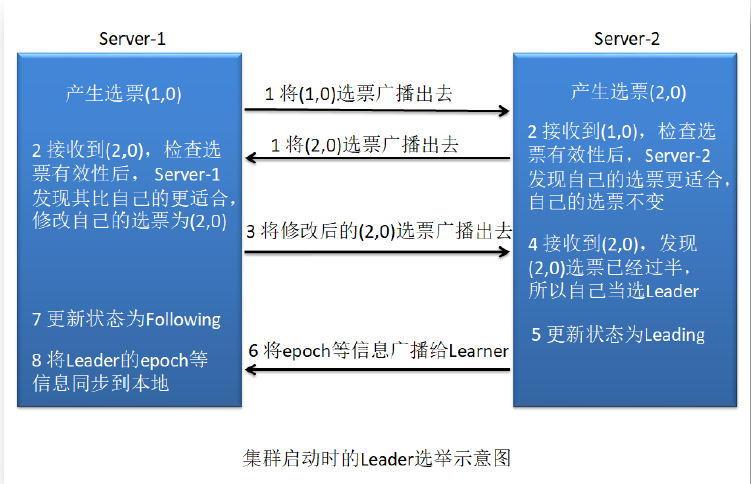
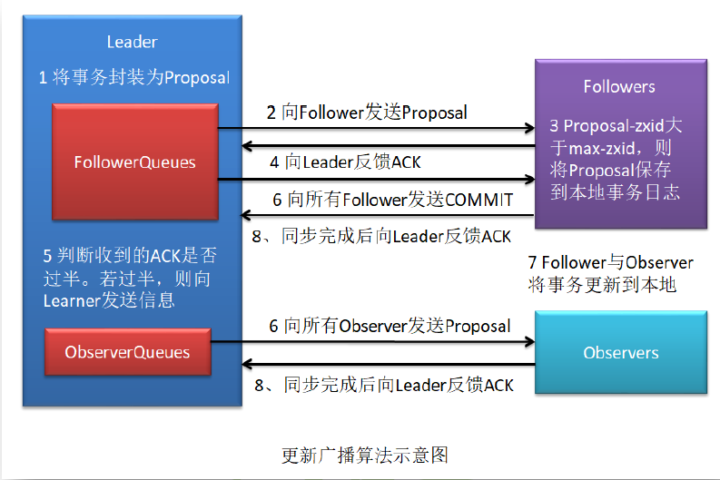

# ZK知识点笔记：

## 一、概念

​		ZooKeeper是一个分布式应用程序协调服务，提供的功能包括：发布/订阅、负载均衡、命名服务、分布式协 	  调/通知、集群管理、Master 选举、配置维护，名字服务、分布式同步、分布式锁和分布式队列 等功能；

## 二、节点类型

​	zk维护一个类似文件系统的数据结构，每个子目录称为znode，其中znode有4种类型：

​	 **PERSISTENT-持久化目录节点**：

​			客户端与zookeeper断开连接后，该节点依旧存在；

​	**PERSISTENT_SEQUENTIAL-持久化顺序编号目录节点**：

​			客户端与zk断开连接后，该节点依旧存在，只是zk给该节点名称进行顺序编号；

​	**EPHEMERAL-临时目录节点**:

​			客户端与zookeeper断开连接后，该节点被删除;

​	**EPHEMERAL_SEQUENTIAL-临时顺序编号目录节点**:

​			客户端与zookeeper断开连接后，该节点被删除，只是Zookeeper给该节点名称进行顺序编号;

## 三、集群角色

​	**Leader**：负责进行投票的发起和决议，更新系统状态；

​	**Observer**：可以接受客户端连接，将写请求转发给leader，不参与投票；

​	**Follower**：用于接受客户端请求并想客户端返回结果，在选主过程中参与投票；

## 四、Zk工作原理

​	相关概念：

#### 	serverId（服务器ID 即 myid）；

#### 	zxid：事务Id；

#### 	epoch：逻辑时钟、投票次数		

​		Zk的核心是原子广播，这个机制保证各个Server之间的同步，实现该机制的协议是Zab协议；其中，Zab协议有2种模式：恢复(选主)模式、广播(同步)模式。当服务启动或者在领导者崩溃后，Zab就进入了恢复模式，当Leader被选举出来，且大多数Server完成了和 leader的状态同步以后，恢复模式就结束了。状态同步保证了leader和Server具有相同的系统状态。

​		为了保证顺序的一致性。zk采用了递增的事务id(zxid)来标志事务，所有的提议在被提出的时候就加上了zxid，zxid是64位的数组，高32位是epoch(逻辑时钟值、投票数次)标识当前属于哪个leader，低32位是事务xid，xid是递增计数。（zxid（64位数字）=高32+低32位=epoch+xid）。

选举状态：

- LOOKING，竞选状态。
- FOLLOWING，随从状态，同步leader状态，参与投票。
- OBSERVING，观察状态,同步leader状态，不参与投票。
- LEADING，领导者状态。

#### Zab与Paxos的关系：

​		ZAB协议是Paxos算法的一种工业实现算法。但两者的设计目标不太一样。

​		ZAB协议主要用于构建一个高可用的分布式数据主从系统，即Follower是Leader的从机，Leader挂了，马上就可以选举出一个新的Leader，但平时它们都对外提供服务。

​		Fast Paxos算法则是用于构建一个分布式一致性状态机系统，确保系统中各个节点的状态都是一致的

## 五、ZK的选主流程

​	Zk的选举算法有两种：一种是基于basic paxos实现的，另外一种是基于fast paxos算法实现的。系统默认的选举算法为fast paxos。

###     basic paxos算法：

​	1、当Porposer希望提出方案V1，首先发出prepare请求至大多数Acceptor。Prepare请求内容为序列号SN1;

​	2、当Acceptor接收到prepare请求SN1时，检查自身上次回复过的prepare请求SN1

​		a). 如果SN2>SN1，则忽略此请求，直接结束本次批准过程;

​		b). 否则检查上次批准的accept请求<SNx，Vx>，并且回复<SNx，Vx>；如果之前没有进行过批准，则简单回复ok；

​	3、Porposer收到Acceptor的回复结果，遵守少数服从多数的规则，选出得票最多的方案。

​	4、当各个Acceptor达到一致之后，将结果通知给Learner。

### 	fast paxos算法：

​		**1、初始化选票**。每个服务器都会初始化自身的选票，将自己推举为Leader，如：Server1的投票为(1, 0)，			  Server2的投票为(2, 0)；

​		**2、发送初始化选票**。完成选票的初始化后，发起第一次投票。Zk将刚刚初始化好的选票放入sendqueue中，			  由发送器WorkerSender负责发送出去；

​		**3、接收外部投票**。从recvqueue队列中获取外部选票。

​		**4、校验选票**。 接受来自各个服务器的投票。集群的每个服务器收到投票后，首先判断该投票的有效性，如检			  查是否是本轮投票、是否来自LOOKING状态的服务器。

​		**5、 处理投票**。针对每一个投票，服务器都需要将别人的投票和自己的投票进行PK，PK规则如下：
​					a、优先检查ZXID。ZXID比较大的服务器优先作为Leader。
​					b、如果ZXID相同，那么就比较myid。myid较大的服务器作为Leader服务器。
​					对于Server1而言，它的投票是(1, 0)，接收Server2的投票为(2, 0)。其首先会比较两者的ZXID，均为			  0，再比较myid，此时Server2的myid最大，于是Server1更新自己的投票为(2, 0)，然后重新投票。			  Server2无须更新自己的投票，再次向集群中所有主机发出上一次投票信息。

​		**6、选票归档**。无论是否变更了投票，都会将刚刚收到的那份外部投票放入选票集合recvset中进行归档。			  recvset用于记录当前服务器在本轮次的Leader选举中收到的所有外部投票。

​		**7、 统计投票**。每次投票后，服务器都会统计投票信息，判断是否已经有过半机器接受到相同的投票信息。对			  于Server1、Server2而言，都统计出集群中已经有两台主机接受了(2, 0)的投票信息，此时便认为已经选出			  了新的Leader，即Server2。

​		**8、 改变服务器状态**。一旦确定了Leader，每个服务器就会更新自己的状态，如果是Follower，那么就变更			   为FOLLOWING，如果是Leader，就变更为LEADING。

​		**9、 添加主机**。在新的Leader选举出来后Server3启动，由于当前集群中各个主机的状态并不是LOOKING，			   以Follower的身份加入到集群中。

备注：

在进行投票过程中，存在2个队列，用于接收、发送选票；

​		**sendqueue**：选票发送队列，用于保存待发送的选票。

　　**recvqueue**：选票接收队列，用于保存接收到的外部投票。

　　**WorkerReceiver**：选票接收器。接收选票，然后保存到recvqueue中，在选票接收过程中，如果发现该外部选票的选举轮次小于当前服务器的，那么忽略该外部投票，同时立即发送自己的内部投票。

　　**WorkerSender**：选票发送器。

### 六、ZK的广播模式

​		1、 Leader 接收到事务请求后，为事务赋予一个全局唯一的 64 位自增 id，即zxid，通过 zxid 的大小比较即可实现事务的有序性管理，然后将事务封装为一个Proposal。
​		2、Leader根据Follower列表获取到所有Follower，然后再将Proposal通过这些Follower的队列将提案发送给各个Follower。
​		3、当Follower 接收到提案后，会先将提案的zxid与本地记录的事务日志中的最大的zxid进行比较。若当前提案的zxid大于最大zxid，则将当前提案记录到本地事务日志中，并向Leader 返回一个ACK。（提问学员）
​		4、当Leader 接收到过半的 ACKs 后，Leader 就会向所有Follower的队列发送 COMMIT消息，向所有Observer的队列发送Proposal。
​		5、当 Follower收到 COMMIT 消息后，就会将日志中的事务正式更新到本地。当Observer收到Proposal后，会直接将事务更新到本地。
​		6、无论是Follower还是Observer，在同步完成后都需要向Leader发送成功ACK。

